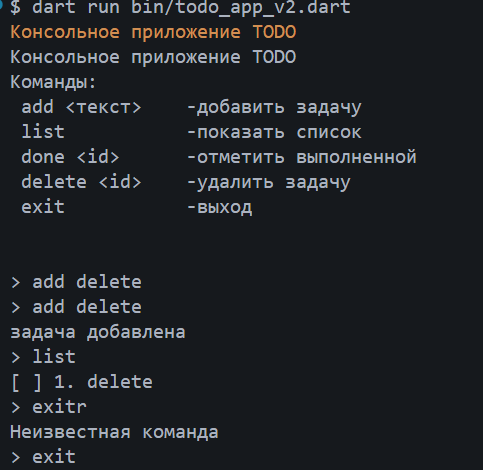

# Лабораторная работа №1. Быстрое погружение в язык Dart
#### Цель работы: Изучить основы языка Dart, сравнивая синтаксис и концепции с ранее изученными языками Kotlin и C#. Создать консольное приложение ToDo.
Необходимые инструменты:
• Dart SDK 3.0+ 
• VS Code (рекомендуется для лабораторной работы), либо IntelliJ IDEA / 
Android Studio с установленным плагином Dart
• Git
### Скриншот заданий

### Что изучили: 
Dart — объектно-ориентированный язык программирования, разработанный Google. 
Основные характеристики:
• Статическая типизация с выводом типов (type inference)
• Sound Null Safety — контроль nullable/nonnull значений на этапе компиляции
• Встроенная асинхронность (Future, async/await, Stream)
• Возможность компиляции:
◦ в нативный код (AOT)
◦ в JIT (для разработки)
◦ в JavaScript (для Web)
• Основной язык фреймворка Flutter

### Вопросы
1. Отличия final от const:
- final: Переменная получает значение один раз, но инициализация может происходить во время выполнения программы (runtime).
- const: Значение обязано быть известно на этапе компиляции (compile-time). Это глубокие константы (deeply immutable).
Пример: final DateTime now = DateTime.now(); -  работает (время вычисляется сейчас). const DateTime now = DateTime.now(); — вызовет ошибку, так как время не известно до запуска.
2. Что означает String?
`String` в Dart — это встроенный тип данных, представляющий последовательность символов UTF-16, то есть текстовую строку. Строки могут быть объявлены в одинарных `'` или двойных `"` кавычках. 
3. Future vs обычное значение и await:
- Future: Это "обещание" значения. В отличие от обычного значения, Future вернет результат (или ошибку) позже (асинхронно), не блокируя основной поток выполнения.
- await: Ключевое слово, которое с точки зрения потока выполнения приостанавливает выполнение только текущей асинхронной функции (метод async) до тех пор, пока Future не завершится. Это делает асинхронный код похожим на синхронный, предотвращая зависание пользовательского интерфейса.

4. Именованные конструкторы в Dart vs Перегрузка в C#:

- Именованные конструкторы `(ClassName.name())` используются для создания нескольких конструкторов, так как обычный конструктор может быть только один.
- Зачем: Они дают возможность создавать экземпляры с понятными именами (User.fromMap(...), User.fromJson(...)), что улучшает читаемость и делает код более понятным, чем просто перегрузка сигнатур.